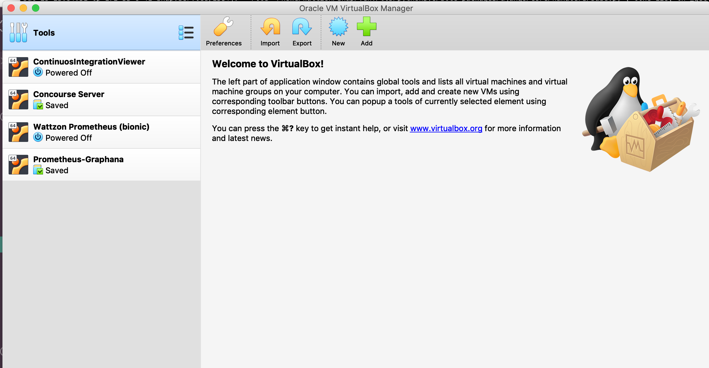

# Workshop:


&nbsp;&nbsp;&nbsp;&nbsp;&nbsp;&nbsp;&nbsp;&nbsp;&nbsp;&nbsp;&nbsp;&nbsp;&nbsp;


## Setting up your local environment.
---
### Contents

- [Goal](#goal)
- [Requirements](#requirements)
- [Vagrant](/docs/vagrant-notes.md)
  * What Vagrant is?
  * Getting a box
  * Define your VMs
  * Commands
- [Ansible](docs/ansible-notes.md)
  * What Ansible is?
  * Write some tasks
  * Write a playbook
  * Write a role
- [Project Layout](docs/project-layout.md)
  * Provision a small web application
    - System role
    - MongoDB role
    - Application role
    - Ngix role
    - Systemd role
    - Database playbook
    - Application playbook
    - Run your playbooks

---

#### Goal

Attendes will learn what `vagrant` and `Ansible` are, will be able to define a local infrastructure based on VM's and they'll learn how to setup a server using a configuration management tool like `Ansible` using the `ansible-vault` to keep secrets "secrets".


#### Requirements

To attend the workshop you need to have the following software installed and the order is suggested:

- __Virtualbox (6.0)__ - Which is used as a provider supporting the VM creation. [Download](https://www.virtualbox.org/wiki/Downloads)

*After this you should be able to see the GUI of Virtualbox on your computer.*



- __python (3.6)__ - Ansible is written on python and this is one of the stable versions for now. [Download](https://www.python.org/downloads/release/python-368/)

*To confirm the python installation runs the following command*

```bash
# most common
> python3

# in case you have another python version like 3.7
# you should be more specific
> python3.6
```

*which will open an interactive console, write __exit()__ for finishing the session*

```python
> python3
Python 3.6.5 (default, Apr 25 2018, 14:23:58)
Type "help", "copyright", "credits" or "license" for more information.
>>>
>>> exit()
>
```

- __Vagrant (2.2.5)__ - a wrapper tool to handle VM's from different providers. [Download](https://www.vagrantup.com/downloads.html)

*Once installed try the following commands to confirm everything is working fine.*

```bash
> vagrant --version
Vagrant 2.2.5
```

*Let's add the box we're gonna use for the WS, you can think in a box like a version of a VM, and that version will be downloaded from the [box catalog](https://app.vagrantup.com/boxes/search) to our localfiles*

```bash
> vagrant box add ubuntu/bionic64
```

- __Ansible (~2.7)__ - A configuration management tool written on Python.

To install the library you should run the next command and give the permission:

```bash
> sudo pip install ansible==2.7.11

# if you can't find the command then try specifying the python version
> sudo pip3 install ansible==2.7.11
```

*Try the following commands to confirm*

```bash
> ansible --version
ansible 2.7.11
  config file = None
  ...
```

```bash
> ansible-vault --version
ansible-vault 2.7.11
  config file = None
  ...
```

If you were able to run all the commands then you are ready.

#### Let's rock!
