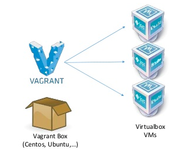

# Vagrant

### Contents

- Vagrant
  * [What Vagrant is?](#what-vagrant-is)
  * [Getting a box](#getting-a-box)
  * [Define your VMs](#define-your-vms)
  * [Commands](#commands)

---


#### What Vagrant is?

Vagrant is a tool for building and managing virtual machine environments.
With an easy-to-use workflow and focus on automation, Vagrant lowers development environment setup time, increases production parity, and makes the __"works on my machine"__ excuse a relic of the past.


Machines are provisioned on top of VirtualBox, VMware, AWS, Docker and others. Then, industry-standard provisioning tools such as shell scripts, Chef, or Puppet, can automatically install and configure software on the virtual machine.

-----
#### Getting a box

Instead of building a virtual machine from scratch, which would be a slow and tedious process, Vagrant uses a base image to quickly clone a virtual machine. These base images are known as __"boxes"__ in Vagrant, and specifying the box to use for your Vagrant environment is always the first step after creating a new Vagrantfile.

This task could be covered in two ways:

1. Waiting to the moment of creation of the VM and then download the required box.
2. Get the box previously and keep it on local to be used later as we did in the requirements section.



-----
#### Define your VMs

The important file working with vagrant is the __Vagrantfile__ where you'll define your VMs, what ports are you interested in, the networking stuffs and so on. We are gonna use ubuntu bionic on our VM.


Let's define our first VM:

1. Create a Vagrantfile (without any extension).
2. Start filling the file file with these lines.

```ruby
# -*- mode: ruby -*-
# vi: set ft=ruby :

Vagrant.configure("2") do |config|

end
```

*First two lines are usually included to tell the editor how it should read the content of the file. (first line for emacs and second one for vim)*

*The other lines defines a block following the syntax of vagrant v2 and defines an object config.*

3. Add the concrete definition.

```ruby
...
  config.vm.define "webappserver" do |webappserver|
    webappserver.vm.box = "ubuntu/bionic64"
    webappserver.vm.network "forwarded_port", guest: 8000, host: 8080
  end
...
```

*This block define the box used by the VM and indicates we want to forward a port 8000 in the guest to the port 8080 on the host. (The block goes inside the previous block))*

4. Define some VM features like RAM, name and cpus and more important the provider.

```ruby
    ...
        webappserver.vm.provider "virtualbox" do |vb|
          vb.memory = "2048"
          vb.name = "WebApplicationServer"
          vb.cpus = 2
        end
    ...
```

*The block goes next to the __webappserver.vm.network__ line.*

5. Execute the following command to see your VM up and running.

```bash
> vagrant up
```

*You should see an output as follows*

```
Bringing machine 'webappserver' up with 'virtualbox' provider...
==> webappserver: Importing base box 'ubuntu/bionic64'...
==> webappserver: Matching MAC address for NAT networking...
==> webappserver: Checking if box 'ubuntu/bionic64' version '20190327.0.0' is up to date...
==> webappserver: A newer version of the box 'ubuntu/bionic64' for provider 'virtualbox' is
==> webappserver: available! You currently have version '20190327.0.0'. The latest is version
==> webappserver: '20190801.1.0'. Run `vagrant box update` to update.
==> webappserver: Setting the name of the VM: WebApplicationServer
==> webappserver: Fixed port collision for 22 => 2222. Now on port 2203.
==> webappserver: Clearing any previously set network interfaces...
==> webappserver: Preparing network interfaces based on configuration...
    webappserver: Adapter 1: nat
==> webappserver: Forwarding ports...
    webappserver: 8000 (guest) => 8080 (host) (adapter 1)
    webappserver: 22 (guest) => 2203 (host) (adapter 1)
==> webappserver: Running 'pre-boot' VM customizations...
==> webappserver: Booting VM...
==> webappserver: Waiting for machine to boot. This may take a few minutes...
    webappserver: SSH address: 127.0.0.1:2203
    webappserver: SSH username: vagrant
    webappserver: SSH auth method: private key
    webappserver: Warning: Connection reset. Retrying...
    webappserver: Warning: Remote connection disconnect. Retrying...
    webappserver:
    webappserver: Vagrant insecure key detected. Vagrant will automatically replace
    webappserver: this with a newly generated keypair for better security.
    webappserver:
    webappserver: Inserting generated public key within guest...
    webappserver: Removing insecure key from the guest if it's present...
    webappserver: Key inserted! Disconnecting and reconnecting using new SSH key...
==> webappserver: Machine booted and ready!
==> webappserver: Checking for guest additions in VM...
    webappserver: The guest additions on this VM do not match the installed version of
    webappserver: VirtualBox! In most cases this is fine, but in rare cases it can
    webappserver: prevent things such as shared folders from working properly. If you see
    webappserver: shared folder errors, please make sure the guest additions within the
    webappserver: virtual machine match the version of VirtualBox you have installed on
    webappserver: your host and reload your VM.
    webappserver:
    webappserver: Guest Additions Version: 5.2.18
    webappserver: VirtualBox Version: 6.0
==> webappserver: Mounting shared folders...
    webappserver: /vagrant => /Users/volivares/git/workshops/ws-vagrant-ansible
```

Notes: By default vagrant will mount the root folder to a /vagrant directory on the guest.

```
/vagrant => /Users/volivares/git/workshops/ws-vagrant-ansible
```

This behavior should be the same adding other options to the __webappserver__ definition and you can setup more synced folders.

```ruby
      ...
      webappserver.vm.synced_folder ".", "/vagrant"
```


-----
#### Commands

There are some command to manage your VMs.


```bash
> vagrant global-status
```

*Return some information about all the VMs on your system*

```bash
> vagrant status
```

*Return some information about the VMs on your current folder*

```bash
> vagrant up [name|id]
```

*This command creates and configures guest machines according to your Vagrantfile.. The __id__ is the showed ib the previous command.*

```bash
> vagrant suspend [name|id]
```

*A suspend effectively saves the exact point-in-time state of the machine, so that when you resume it later, it begins running immediately from that point, rather than doing a full boot.*

```bash
> vagrant resume [name|id]
```

*This resumes a Vagrant managed machine that was previously suspended, perhaps with the suspend command.*

```bash
> vagrant provision [vm-name]
```

*Runs any configured provisioners against the running Vagrant managed machine.*

*--provision-with x,y,z - This will only run the given provisioners. For example, if you have a :shell and :chef_solo provisioner and run vagrant provision --provision-with shell, only the shell provisioner will be run.*

```bash
> vagrant ssh [name|id]
```

*This will SSH into a running Vagrant machine and give you access to a shell.*

```bash
> vagrant halt [name|id]
```

*This command shuts down the running machine Vagrant is managing. -f or --force - Do not attempt to gracefully shut down the machine. This effectively pulls the power on the guest machine.*

```bash
> vagrant destroy [name|id]
```

*This command stops the running machine Vagrant is managing and destroys all resources that were created during the machine creation process. -f or --force - Do not ask for confirmation before destroying.*

[Next... Ansible](ansible-notes.md)
